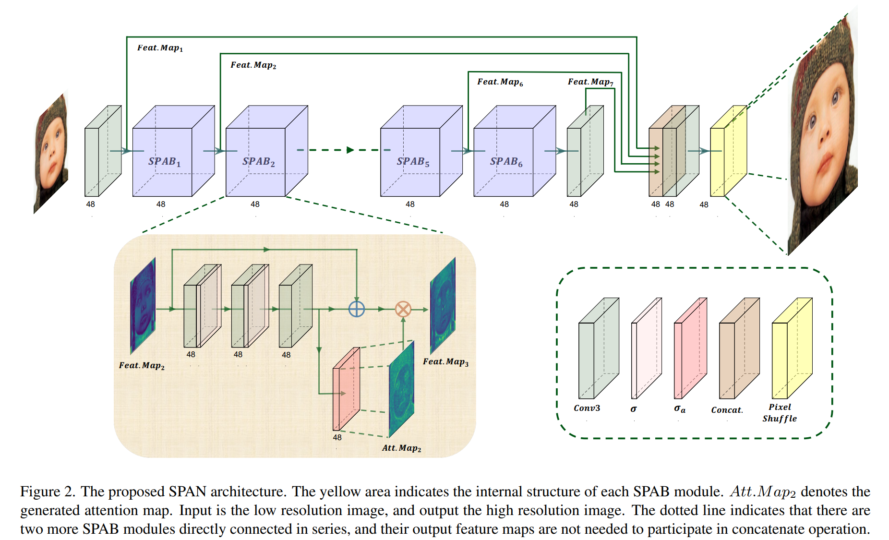
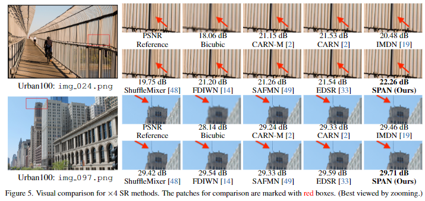

# Swift Parameter-free Attention Network for Efficient Super-Resolution

<div align="center">
  
  <!-- <p>cell.</p> -->
</div>

The official pytorch implementation of the paper [Swift Parameter-free Attention Network for Efficient Super-Resolution](https://arxiv.org/pdf/2311.12770.pdf)

Single Image Super-Resolution (SISR) is a crucial task in low-level computer vision, aiming to reconstruct high-resolution images from low-resolution counterparts. Conventional attention mechanisms have significantly improved SISR performance but often result in complex network structures and large number of parameters, leading to slow inference speed and large model size. To address this issue, we propose the Swift Parameter-free Attention Network (SPAN), a highly efficient SISR model that balances parameter count, inference speed, and performance. SPAN employs a novel parameter-free attention mechanism, which leverages symmetric activation functions and residual connections to enhance high-contribution information and suppress redundant information. Our theoretical analysis demonstrates the effectiveness of this design in achieving the attention mechanism's purpose. We evaluate SPAN on multiple benchmarks, showing that it outperforms existing efficient super-resolution models in terms of both performance and inference speed, achieving a significant performance-speed trade-off. This makes SPAN highly suitable for real-world applications, particularly in resource-constrained scenarios. Notably, our model attains the best PSNR of 27.09 dB, and the test runtime of our team is reduced by 7.08ms in the NTIRE 2023 efficient super-resolution challenge.

<div align="center">
  
  <!-- <p>cell.</p> -->
</div>


## Installation:
This implementation based on [BasicSR](https://github.com/xinntao/BasicSR). Please refer to BasicSR for training and testing.
You can obtain all the checkpoints and results from [[Google Drive](https://drive.google.com/file/d/1iYUA2TzKuxI0vzmA-UXr_nB43XgPOXUg/view?usp=sharing)].

```python
python 3.9.5
pytorch 1.11.0
cuda 11.3
```

```
git clone this repo
cd SPAN
pip install -r requirements.txt
python setup.py develop --no_cuda_ext
```


## Results
<div align="center">
  
  <!-- <p>cell.</p> -->
</div>

<div align="center">
  
  <!-- <p>cell.</p> -->
</div>


## 📜 License and Acknowledgement

This project is released under the [Apache 2.0 license](LICENSE.txt).<br>
More details about **license** and **acknowledgement** are in [LICENSE](LICENSE/README.md).
